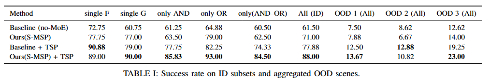
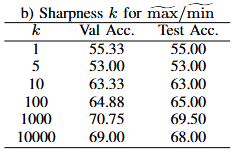
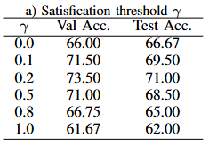
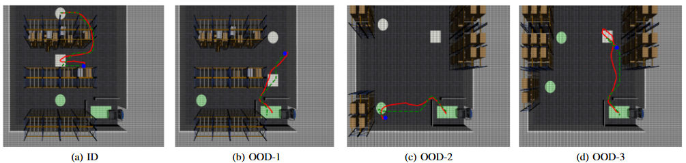

# E2E-Signal-Temporal-Logic-Planner


**Structured-MoE STL Planner (S-MSP)**: an end-to-end differentiable framework that maps synchronized multi-view camera observations and an STL specification directly to a feasible trajectory.

> 🎉 **Accepted to ICRA 2026**.

---

## Model Structure

<p align="center">
  
</p>
<p align="center">
  <em>S-MSP maps multi-view observations and STL specifications directly to feasible trajectories with a structure-aware MoE and last introduce a safety filter.</em>
</p>

---

## News
- **2026-01-31**: Paper accepted to **ICRA 2026**.
- **2026-02-02**: Code release.
- **To be Done**：Final code release.

---

## Abstract

We investigate the task and motion planning problem for Signal Temporal Logic (STL) specifications in robotics. Existing STL methods rely on pre-defined maps or mobility representations, which are ineffective in unstructured real-world environments.

We propose the *Structured-MoE STL Planner* (**S-MSP**), a differentiable framework that maps synchronized multi-view camera observations and an STL specification directly to a feasible trajectory. S-MSP integrates STL constraints within a unified pipeline, trained with a composite loss that combines trajectory reconstruction and STL robustness. A *structure-aware* Mixture-of-Experts (MoE) model enables horizon-aware specialization by projecting sub-tasks into temporally anchored embeddings.

We evaluate S-MSP using a high-fidelity simulation of factory-logistics scenarios with temporally constrained tasks. Experiments show that S-MSP outperforms single-expert baselines in STL satisfaction and trajectory feasibility. A rule-based *safety filter* at inference improves physical executability without compromising logical correctness, showcasing the practicality of the approach.

---


## Results

### Main quantitative comparison

<p align="center">
  
</p>
<p align="center">
  <em>Main quantitative comparison on factory-logistics STL tasks.</em>
</p>

### Additional results

<p align="center">
  
  
</p>
<p align="center">
  
</p>
<p align="center">
  
</p>
<p align="center">
  <em>Qualitative visualizations and ablations study.</em>
</p>

---

## Citation

If you find this repository useful, please cite our paper:

```bibtex
@misc{ye2025bridgingperceptionplanning,
  title         = {Bridging Perception and Planning: Towards End-to-End Planning for Signal Temporal Logic Tasks},
  author        = {Ye, Bowen and Huang, Junyue and Liu, Yang and Qiao, Xiaozhen and Yin, Xiang},
  year          = {2025},
  eprint        = {2509.12813},
  archivePrefix = {arXiv},
  primaryClass  = {cs.RO},
  url           = {https://arxiv.org/abs/2509.12813}
}

